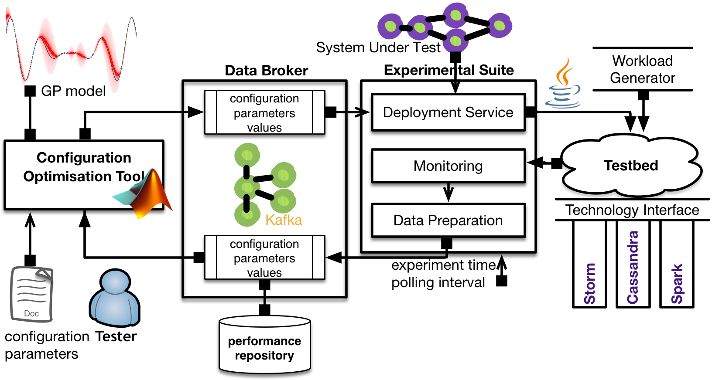
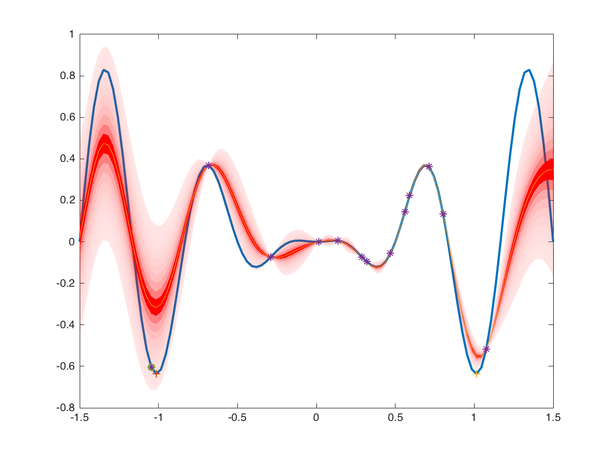
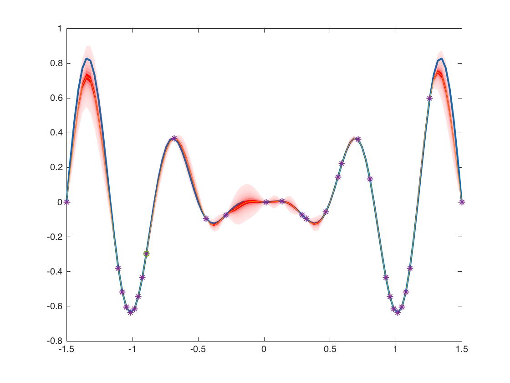

# BO4CO [](https://github.com/dice-project/DICE-Configuration-BO4CO/blob/master/LICENSE.txt)

## Introduction
Configuration Optimization Tool for Big Data Systems

Bayesian Optimization for Configuration Optimization (BO4CO) is an auto-tuning algorithm for Big Data applications. Big data applications typically are developed with several technologies (e.g., Apache Storm, Hadoop, Spark, Cassandra) each of which has typically dozens of configurable parameters that should be carefully tuned in order to perform optimally. BO4CO helps end users of big data systems such as data scientists or SMEs to automatically tune the system.  

## Architecture
The following figure illustrates components of BO4CO:
(i) optimization component, (ii) experimental suite, (iii) and a data broker. 



## Automated installation with Chef

We provide an automated installation of the BO4CO via a Chef cookbook.

In a dedicated Ubuntu 14.04 host, first install the
[Chef Development Kit](https://downloads.chef.io/chef-dk/), e.g.:

```bash
$ wget https://packages.chef.io/stable/ubuntu/12.04/chefdk_0.15.16-1_amd64.deb
$ sudo dpkg -i chefdk_0.15.16-1_amd64.deb
```

Then obtain this cookbook repository:

```bash
$ git clone https://github.com/dice-project/DICE-Chef-Repository.git
$ cd DICE-Chef-Repository
```

Before we run the installation, we just need to provide the configuration,
pointing to the external services that the Configuration Optimization relies
on. We provide this configuration in a `json` file. Let us name it
`configuration-optimization.json`:

```json
{
  "dice-h2020": {
    "conf-optim": {
      "ds-container": "4a7459f7-914e-4e83-ab40-b04fd1975542"
    },
    "deployment-service": {
      "url": "http://10.10.50.3:8000",
      "username": "admin",
      "password": "LetJustMeIn"
    },
    "d-mon": {
      "url": "http://10.10.50.20:5001"
    }
  }
}
```

Here, the parameters represent:
* `ds-container` is the UUID of the
  [DICE deployment service](https://github.com/dice-project/DICE-Deployment-Service)
  container dedicated to the application to run and optimize,
* `deployment-service` contain the access point and credentials of the DICE
  Deployment Service to be used by the CO,
* `d-mon` contains parameters used by the CO to connect to the DICE monitoring
  framework.

Now we can start the Chef process:

```bash
$ sudo chef-client -z \
    -o recipe[apt::default],recipe[java::default],recipe[dice-h2020::deployment-service-tool],recipe[dice-h2020::conf-optim],recipe[storm-cluster::common] \
    -j configuration-optimization.json
```

When the execution succeeds, the Configuration Optimization will be installed
in `/opt/co/` by default. The command will also install the Storm client
(thanks to the `recipe[storm-cluster::common]` provided at the end of the
runlist above).

**Notes about tool configuration:** the Chef recipe creates three configuration
files in the `/opt/co/conf` folder. The `config.yaml` contains the parameters
transferred from the `configuration-optimization.json` listed above. The
`app-config.yaml` is an example experiment declaration file like it should
be supplied with the application. The `expconfig.yaml` is an assembled
configuration file as defined [later in the document](#tool-configuration) and
will be the one used by the BO4CO. The recipe employs
[configuration merge tool](utils/README.md) to create the `expconfig.yaml`.

## Manual installation

The configuration tool works in `deployed` and `MATLAB` mode. The `deployed` mode does not need any MATLAB installation and only is dependent on a royalty free [MATLAB Runtime (MCR)](http://uk.mathworks.com/products/compiler/mcr/). 

### Getting BO4CO

Regardless of the method, first download the tool using git,
a package download, or a pre-compiled binary downloads. 

Git:

```bash
$ mkdir -p ~/myrepos ; cd ~/myrepos
$ git clone https://github.com/dice-project/DICE-Configuration-BO4CO.git
$ cd DICE-Configuration-BO4CO
```

Package:

```bash
$ mkdir -p ~/myrepos ; cd ~/myrepos
$ wget https://github.com/dice-project/DICE-Configuration-BO4CO/archive/master.zip
$ unzip DICE-Configuration-BO4CO-master.zip
# This step is only to unify the result with the one from the git download
$ mv DICE-Configuration-BO4CO-master DICE-Configuration-BO4CO
$ cd DICE-Configuration-BO4CO
```

Binary releases:

```bash
$ wget https://github.com/dice-project/DICE-Configuration-BO4CO/releases/download/v0.1.1/bin.zip
$ unzip bin.zip
```

### Installation

First, install MCR on the platform you intends to run the tool, e.g., here is the instructions for `ubuntu`: 

```bash
$ cd install/
$ ./install_mcr.sh
```

### Compilation

We already prepared the compiled versions for `ubuntu64` and `maci64` deployment target, for this you need to download the `bin.zip` from the latest tool [release](https://github.com/dice-project/DICE-Configuration-BO4CO/releases). So only the compiled files needs to get copied into the `target` folder, where BO4CO will be deployed:

```bash
$ cd DICE-Configuration-BO4CO/
$ wget https://github.com/dice-project/DICE-Configuration-BO4CO/releases/download/v0.1.1/bin.zip
$ unzip bin.zip
$ cp bin/ubuntu64/* target
$ cp deploy/run_bo4co.sh target
$ cp -r src/conf target
```

It is also possible to prepare a new compiled version for a new target architecture such as `windows64`. You only need to run the following command in MATLAB on the target environment (i.e., target architecture and MCR version) in order to compile the source files:

```Matlab
cd DICE-Configuration-BO4CO/src
run compile.m
```

Note that it is essential to run `compile.m` in the target environment otherwise the execution of the compiled version will fail. We are happy to provide compiled version for a target environment, you only need to drop us an email, see contact bellow.


### Tool configuration

The user of the tool needs to configure BO4CO by specifying the configuration parameters in `expconfig.yaml`:

```bash
$ cd target/
$ vim conf/expconfig.yaml
```

`expconfig.yaml` comprises several important parts: `runexp` specifies the experimental parameters, `services` comprises the detals of the services which BO4CO uses, `application` is the details of the application, e.g., storm topology and the associated Java classes, and most importantly the details of the configuration parameters are specified in `vars` field.  

For example, the following parameters specify the experimental budget (i.e., total number of iterations), the number of initial samples, the experimental time, polling interval and the interval time between each experimental iterations, all in milliseconds:

```yaml
runexp:
  numIter: 100
  initialDesign: 10
  ...
  expTime: 300000
  metricPoll: 1000
  sleep_time: 10000
```

The following parameters specify the name of the configuration parameter, the node for which it is going to be used, possible values for the parameter and lower bound and upper bound if it is integer, otherwise it would be categorical. 

```yaml
vars:
  - paramname: "topology.max.spout.pending" 
    node: ["storm", "nimbus"] 
    options: [1 2 10 100 1000 10000]
    lowerbound: 0
    upperbound: 0
    integer: 0
    categorical: 1
```

The experimental suite component of BO4CO is depdent on [DICE Deployment service](https://github.com/dice-project/DICE-Deployment-Service), so before starting BO4CO, the deployment service needs to be installed:

```bash
$ mkdir -p ~/myrepos ; cd ~/myrepos
$ git clone https://github.com/dice-project/DICE-Deployment-Service.git
```

Moreover, the DICE deployment service needs to be running somewhere (see the [guideline](https://github.com/dice-project/DICE-Deployment-Service/blob/master/doc/AdminGuide.md)) and the associated filed in `expconfig.yaml` needs to be updated accordingly:

```yaml
services:    
  - servicename: "deployment.service"
    URL: "http://xxx.xxx.xxx.xxx:8000"
    container: "CONTAINER ID"
    username: "your username"
    password: "your password"
    tools: "/Repos/DICE-Deployment-Service/tools"
```


In the `services` field in `expconfig.yaml` the location of the deployment services tools needs to be updated accordingly, i.e., `~/myrepos/DICE-Deployment-Service/tools`.


### Starting BO4CO

To run BO4CO you just need to execute the following bash script, make sure the configuration parameters are set properly before running this:


```bash
$ cd target/
$ ./run_bo4co.sh
```

### Performance Data

The experimental data are stored in a performance repository located inside the `target` folder. `integrated/reports` stores the detailed measurements separated by each configuration setting in `csv` format. `integrated/summary` stores the summary of measurements in terms of average latency and throughput separated by each experiment. After the experimental budget is finished, a `MAT-File` will be dumped into the `integrated/summary` folder.  


### Demo

It is also possible to optimize arbitrary functions with BO4CO where each measurement corresponds to a function evaluation in MATLAB. For runnig BO4CO demo follow these instructions:


```Matlab
run setup.m
edit conf/config.m # set nMinGridPoints, istestfun, visualize, maxExp, maxIter, nInit
run demo/demo_bo4co.m
```

#### Visualization


...


#### Output

```Matlab
Grid point is better than previous hyperparameter
Function evaluation      0;  Value -1.375336e+02
Function evaluation      9;  Value -4.517219e+02
Function evaluation     13;  Value -5.702309e+02
Function evaluation     15;  Value -5.872137e+02
Function evaluation     18;  Value -5.929673e+02
Function evaluation     21;  Value -6.039209e+02
Function evaluation     24;  Value -6.069675e+02
Function evaluation     27;  Value -6.071938e+02

Grid point is better than previous hyperparameter
Function evaluation      0;  Value -1.395701e+02
Function evaluation      9;  Value -4.609277e+02
Function evaluation     19;  Value -5.797697e+02
Function evaluation     20;  Value -6.006878e+02
Function evaluation     23;  Value -6.072819e+02
Function evaluation     25;  Value -6.145497e+02
Function evaluation     28;  Value -6.161177e+02
Function evaluation     35;  Value -6.169813e+02

Minimum value: -0.636812 found at:
-1.0131

True minimum value: -0.636816 at:
-1.0127    1.0127
```

### [Live Demo](https://cdn.rawgit.com/pooyanjamshidi/demo/master/bo4co/demo_bo4co.html)

## Complementary materials 
* [Paper](https://arxiv.org/pdf/1606.06543v1) is the key paper about BO4CO. 
* [Wiki](https://github.com/dice-project/DICE-Configuration-BO4CO/wiki) provides more details about the tool and setting up the environment.
* [Data](https://zenodo.org/record/56238) is the experimental datasets.
* [Presentation](http://www.slideshare.net/pooyanjamshidi/an-uncertaintyaware-approach-to-optimal-configuration-of-stream-processing-systems) is a presentation about the tool and our experimental results.
* [Gitxiv](http://gitxiv.com/posts/5XkMY4C3hXScwZ3Tw/an-uncertainty-aware-approach-to-optimal-configuration-of) is all research materials about the tool in one link.
* [TL4CO](https://github.com/dice-project/DICE-Configuration-TL4CO) is the DevOps enabled configuration optimization tool.

### Paper
For more technical details about the approach that has been implemented in the tool please refer to:
```
P. Jamshidi, G. Casale, "An Uncertainty-Aware Approach to Optimal Configuration of Stream Processing Systems", in Proc. of IEEE MASCOTS, (September 2016).
```

## Contact

If you notice a bug, want to request a feature, or have a question or feedback, please send an email to the tool maintainer:

[Pooyan Jamshidi](https://github.com/pooyanjamshidi), pooyan.jamshidi@gmail.com

## Licence

The code is published under the [FreeBSD License](https://github.com/dice-project/DICE-Configuration-BO4CO/blob/master/LICENSE.txt).
