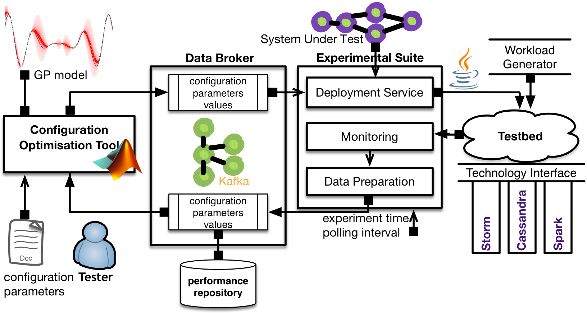

# BO4CO [](https://github.com/dice-project/DICE-Configuration-BO4CO/blob/master/LICENSE.txt)

## Introduction
Configuration Optimization Tool for Big Data Systems

Bayesian Optimization for Configuration Optimization (BO4CO) is an auto-tuning algorithm for Big Data applications. Big data applications typically are developed with several technologies (e.g., Apache Storm, Hadoop, Spark, Cassandra) each of which has typically dozens of configurable parameters that should be carefully tuned in order to perform optimally. BO4CO helps end users of big data systems such as data scientists or SMEs to automatically tune the system.  

## Architecture
The following figure illustrates all the components of BO4CO:
(i) optimization component, (ii) experimental suite, (iii) and a data broker. 




## How to use

The configuration tool works in `deployed` and `MATLAB` mode. `deployed` mode does not need any MATLAB installation and only is dependent on a royalty free [MATLAB compiler](http://uk.mathworks.com/products/compiler/mcr/). 

### Getting BO4CO

Regardless of the method, first download the tool using git or
a package download. With git, run the following steps:

```bash
$ mkdir -p ~/myrepos ; cd ~/myrepos
$ git clone https://github.com/dice-project/DICE-Configuration-BO4CO.git
$ cd DICE-Configuration-BO4CO
```

Or, to obtain the tool, use the following steps:

```bash
$ mkdir -p ~/myrepos ; cd ~/myrepos
$ wget https://github.com/dice-project/DICE-Configuration-BO4CO/archive/master.zip
$ unzip DICE-Configuration-BO4CO-master.zip
# This step is only to unify the result with the one from the git download
$ mv DICE-Configuration-BO4CO-master DICE-Configuration-BO4CO
$ cd DICE-Configuration-BO4CO
```

### Installation

First the install MCR on the platform you intends to runt he tool, e.g., here is the instructions for `ubuntu`: 

```bash
$ cd install/
$ ./install_mcr.sh
```

Then the compiled main file needs to get copied to the `src` folder:

```bash
$ cd DICE-Configuration-BO4CO/
$ cp deploy/ubuntu64/main deploy/ubuntu64/* src
$ cp deploy/run_bo4co.sh src
```


### Tool configuration

The user of the tool needs to configure BO4CO by specifying the configuration parameters in `expconfig.yaml`:

```bash
$ cd DICE-Configuration-BO4CO/
$ vim conf/expconfig.yaml
```

`expconfig.yaml` comprises several important parts: `runexp` specifies the experimental parameters, `services` comprises the detals of the services which BO4CO uses, `application` is the details of the application, e.g., storm topology and the associated Java classes, and most importantly the details of the configuration parameters are specified in `vars` field.  

For example, the following parameters specify the experimentl time (ms), polling interval (ms) and the interval time between each experimental iterations:

    sleep_time: 10000
    metricPoll: 1000
    expTime: 300000

The following parameters specify the name of the configuration parameter, the node for which it is going to be used, possible values for the parameter and lower bound and upper bound if it is integer, otherwise it would be categorical. 

    - paramname: "topology.max.spout.pending" 
      node: ["storm", "nimbus"] 
      options: [1 2 10 100 1000 10000]
      lowerbound: 0
      upperbound: 0
      integer: 0
      categorical: 1

The experimental suite component of BO4CO is depdent on [DICE Deployment service](https://github.com/dice-project/DICE-Deployment-Service), so before starting BO4CO, the deployment service needs to be installed:

```bash
$ mkdir -p ~/myrepos ; cd ~/myrepos
$ git clone https://github.com/dice-project/DICE-Deployment-Service.git
```

Moreover, the DICE deployment service needs to be running soemwhere (see the [guideline](https://github.com/dice-project/DICE-Deployment-Service/blob/master/doc/AdminGuide.md)) and the associated filed in `expconfig.yaml` needs to be updated accordingly:

    services:    
      - servicename: "deployment.service"
        URL: "http://xxx.xxx.xxx.xxx:8000"
        container: "2470bab7-eb25-40be-b021-a1cfbccd5a9f"
        username: "your username"
        password: "your password"
        tools: "/Repos/DICE-Deployment-Service/tools"

In the `services` field in `expconfig.yaml` the location of the deployment services tools needs to be updated accordingly, i.e., `~/myrepos/DICE-Deployment-Service/tools`.


### Starting BO4CO

To run BO4CO you just need to run the following bash script:


```bash
$ cd scr/
$ ./run_bo4co.sh
```

## Complementary materials 
* [Paper](https://arxiv.org/pdf/1606.06543v1) is the key paper about BO4CO. 
* [Wiki](https://github.com/dice-project/DICE-Configuration-BO4CO/wiki) provides more details about the tool and setting up the environment.
* [Data](https://zenodo.org/record/56238) is the experimental datasets.
* [Presentation](http://www.slideshare.net/pooyanjamshidi/transfer-learning-for-optimal-configuration-of-big-data-software) is a presentation about the tool and our experimental results.
* [Gitxiv](http://gitxiv.com/posts/5XkMY4C3hXScwZ3Tw/an-uncertainty-aware-approach-to-optimal-configuration-of) is all research materials about the tool in one link.
* [TL4CO](https://github.com/dice-project/DICE-Configuration-TL4CO) is the DevOps enabled configuration optimization tool.

### Paper
For more technical details about the approach that has been implemented in the tool please refer to:
```
P. Jamshidi, G. Casale, "An Uncertainty-Aware Approach to Optimal Configuration of Stream Processing Systems", in Proc. of IEEE MASCOTS, (September 2016).
```

## Contact

If you notice a bug, want to request a feature, or have a question or feedback, please send an email to pooyan.jamshidi@gmail.com. We would like to hear from people using our code.

## Licence

The code is published under the [FreeBSD License](https://github.com/dice-project/DICE-Configuration-BO4CO/blob/master/LICENSE.txt).
